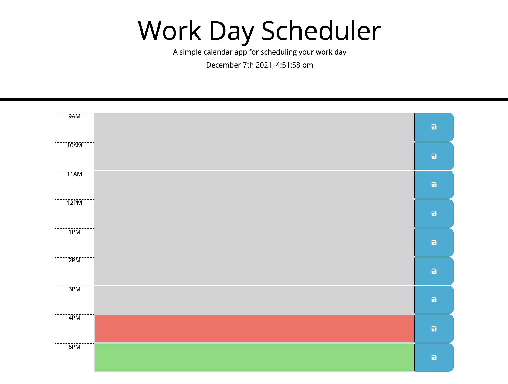

# u5-hw-third-party-api-work-day-scheduler
ITESM Coding Bootcamp - Unit 5 Homework - Third-Party APIs: Work Day Scheduler

This was an on-the-job ticket activity where I was given an HTML and CSS code that had the basic layout for a Work Day Scheduler. I was requested to write some code to show the current date and time in the header, and generate timeblocks from 9:00 am to 5:00 pm. The user should be able to write tasks or appointments for each timeblock and save them, so that, even if the application is reloaded, the saved events should still be in the corresponding timeblock. The website should also have a color code for the timeblocks, with gray being for the past events, red for the present event and green for the future events of the day.

For this activity I wrote all the code in a JavaScript file, using jQuery and moment.js. To begin, I wrote a function using moment.js to show the current date and time, and I used setInterval to update the time each second. Then I used an array to write a for loop to create each html element for the timeblocks (&gt;span&lt;, &gt;textarea&lt; and &gt;button&lt;), adding classes and attributes to them. Next, I wrote the code for the click events of each timeblock button, to save the text written by the user in the browser's local storage and then get each item to post it in the corresponding timeblock textarea. Finally, I made a for loop using moment.js and jQuery to set up some conditional statements to color each timeblock according to it's place in the current day timeline (using gray for past, red for present and green for future)

The final website looks like this image:

The link for the deployed application is this:

https://josevidmal.github.io/u5-hw-third-party-api-work-day-scheduler/